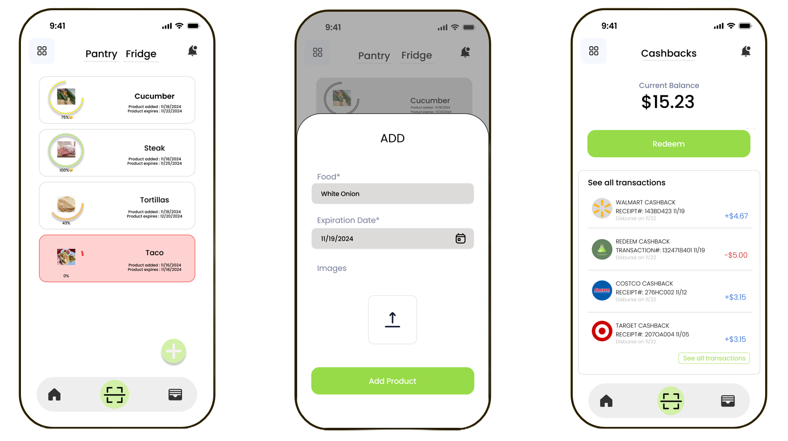

<div align="center">
  
  
  **Application Interface Mockup**
</div>

# FreshGuard 🍎

Fresh Guard is an ADHD-focused application that helps users manage their food intake by providing helpful reminders and suggestions. The full-stack project consists of a React Native/Expo mobile app and an ASP.NET Core Web API backend.

## Features
- Manage food reminders to help people with ADHD maintain healthy eating habits
- User-friendly interface with intuitive design for better accessibility
- Notifications for food intake and healthy eating schedules
- RESTful API endpoints for food tracking and management
- Token-based authentication support (Azure B2C ready)
- CORS enabled for mobile cross-origin communication

---

### Initial Setup Required

Before running the application, you must configure:

1. **AI Server Environment Variables** - See `ai-server/README.md`
2. **Azure Configuration** - Use Azure Key Vault or .NET User Secrets
3. **Configuration Templates** - See `src/fg.API/appsettings.example.json`

For detailed security setup instructions, see `SECURITY_CLEANUP.md`.

---

## 🚀 Getting Started

### Prerequisites
Make sure you have the following installed on your system:

**Frontend:**
- Node.js (version 14 or later) – [Download Node.js](https://nodejs.org/en)
- Expo CLI – Install globally using npm:
```bash
npm install -g expo-cli
```

**Backend:**
- [.NET 8 SDK](https://dotnet.microsoft.com/en-us/download)
- Visual Studio / VS Code / Rider
- Postman (optional, for API testing)
- [Azure CLI](https://learn.microsoft.com/en-us/cli/azure/install-azure-cli) (for Key Vault access)

---

## 📱 Running the Mobile App

### Installation
1. Clone the repository:
```bash
git clone https://github.com/hlnguyenlinh11/FreshGuard.git
cd FreshGuard
```
2. Install dependencies:
```bash
npm install -g npm@lastest
```
or 
```bash
yarn install
```
3. Start the Expo development server:
```bash
yarn start
```
4. IP address to fetch API will update dynamically. If not, change IP address in api.js

### Running the App
After starting the Expo development server, you have a few options:

**On a Physical Device:**
- Download the Expo Go app from the Google Play Store or Apple App Store
- Open Expo Go and scan the QR code provided in your terminal or Expo DevTools to run the app

**On an Emulator:**
- For Android, you can use Android Studio and run an Android emulator
- For iOS, you can use Xcode and run the iOS simulator

---

## 🛠️ Running the Backend API

### Step 1: Login to Azure

Ensure you're authenticated to Azure and have access to the Key Vault secrets.

```bash
az login
```

Then select the correct subscription: 
```bash
az account set --subscription "Fresh Guard Main"
```

Set Key Vault secret permissions if needed: 
```bash
az keyvault set-policy \
  --name fresh-guard-db \
  --object-id <your-object-id> \
  --secret-permissions get list
```
💡 You can find your object ID by running: 
```bash
az ad signed-in-user show --query objectId -o tsv
```

### Step 2: Navigate to the backend folder
```bash
cd backend
```

### Step 3: Run the API
```bash
dotnet run --project src/fg.API/freshguard.csproj
```

The API should start at a port defined in launchSettings.json (e.g., http://localhost:5241).

### Building the Backend
```bash
dotnet build
```

---

## 🌐 API Access on Mobile (IP Setup)

To access the API from your mobile device, replace localhost with your local IP address.

### Find your IP
**Windows:**
```bash
ipconfig
```
**MacOS/Linux:**
```bash
ifconfig
```

### Example
If your IP is 192.168.1.100, then in the frontend .env:
```bash
API_URL=http://192.168.1.100:5241/api
```
📱 Android emulator users: use http://10.0.2.2:5241/api

---

## 🧪 Testing the API 
Once the server is running, test endpoints like:

```bash
GET http://localhost:5241/api/items
```
Or test via Postman:

```bash
curl http://localhost:5241/api/items
```
